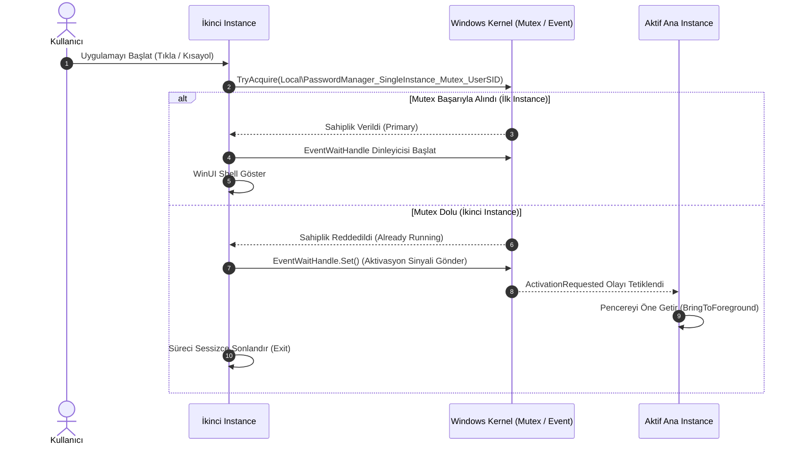

# Depolama Mimarisi, Dizin Güvenliği (ACL) ve Tek Örnek Yönetimi

* **Sürüm:** 1.0 (M0.6)  
* **Tarih:** 7 Ekim 2026  
* **Hedef Platform:** Windows 11 x64  

---

## 1. Veri Yolları: Paketli (Packaged / MSIX) vs. Paketsiz (Unpackaged)

`PasswordManager`, geliştirme ve yerel araç zinciri esnekliği için başlangıçta **Unpackaged (`WindowsPackageType=None`)** olarak çalışmakta, M9 aşamasında ise **MSIX** paketleme seçeneğini değerlendirmektedir. Bu nedenle veri yolları ortam farkını şeffaf şekilde yöneten `IStoragePathProvider` portu ile soyutlanmıştır.

| Ortam | Kök Depolama Yolu (Data Root) | SQLite Kasa Dosyası | Yedekler Klasörü |
| :--- | :--- | :--- | :--- |
| **Unpackaged (Masaüstü)** | `%LOCALAPPDATA%\PasswordManager` | `%LOCALAPPDATA%\PasswordManager\vault.db` | `%LOCALAPPDATA%\PasswordManager\backups\` |
| **Packaged (MSIX Container)** | `%LOCALAPPDATA%\Packages\<PackageFamilyName>\LocalState` | `...\LocalState\vault.db` | `...\LocalState\backups\` |

### Ortam Tespiti
Uygulama başlangıcında Win32 `GetCurrentPackageFullName` API'si çağrılır. API `APPMODEL_ERROR_NO_PACKAGE` (15700) döndürürse sürecin paketsiz Win32 olduğu kesinleşir ve `%LOCALAPPDATA%\PasswordManager` yolu kullanılır.

---

## 2. SQLite Dosya Yapısı ve WAL Davranışı

Veritabanı motoru yüksek performans ve eşzamanlılık için SQLite **Write-Ahead Logging (WAL)** modunu kullanacaktır.

1. **`vault.db`**: Ana veritabanı dosyası (şifreli zarflar ve manifest).
2. **`vault.db-wal`**: Write-Ahead Log günlüğü (tamamlanmamış veya henüz checkpoint edilmemiş işlemler).
3. **`vault.db-shm`**: Paylaşılan bellek indeks dosyası.

> [!CAUTION]
> **Yedekleme Güvenliği:** Bir kasa yedeklenirken veya taşınırken sadece `vault.db` dosyasını kopyalamak WAL içindeki güncel kayıtların kaybolmasına yol açabilir. M3 aşamasındaki yedekleme mantığı SQLite Online Backup API veya atomik checkpoint snapshot mekanizması kullanacaktır.

---

## 3. Windows NTFS Dizin Güvenliği (ACL Kuralları)

Kullanıcının parolalarını içeren şifreli dosyalara aynı makinedeki diğer yerel kullanıcı hesaplarının erişmesini önlemek amacıyla, kök klasör oluşturulurken katı Windows NTFS Erişim Denetim Listesi (ACL) uygulanır:

1. **Kalıtımın Devre Dışı Bırakılması (Inheritance Protection):**  
   Üst dizinden (`C:\Users\<User>`) gelebilecek izin kalıtımı `SetAccessRuleProtection(isProtected: true, preserveInheritance: false)` ile iptal edilir.
2. **Kısıtlı İzin Matrisi:**
   - **Mevcut Kullanıcı (`WindowsIdentity.GetCurrent().User`):** `FullControl` (Tam Denetim).
   - **Yerel Yöneticiler (`BuiltinAdministratorsSid`):** `FullControl`.
   - **Yerel Sistem (`LocalSystemSid`):** `FullControl`.
   - **Diğer Kullanıcılar (`Users`, `Authenticated Users`, `Everyone`):** **Erişim Yok.**

---

## 4. Tek Örnek (Single Instance) Yaşam Döngüsü

Uygulamanın aynı kullanıcı oturumu altında birden fazla kez açılması veritabanı kilit yarışlarına ve bellek tutarsızlıklarına yol açabilir.

### Tasarım İlkeleri:
1. **Oturum İzolasyonu:** Mutex ve olay adları `Local\` namespace'inde ve kullanıcı SID'si ile adlandırılır (`Local\PasswordManager_SingleInstance_Mutex_Default_{UserSID}`). Böylece Windows Çoklu Kullanıcı (Fast User Switching) ortamında farklı kullanıcılar kendi oturumlarında bağımsız olarak uygulamayı çalıştırabilir.
2. **Kullanıcı Deneyimi:** Kullanıcı uygulamayı açıkken masaüstü veya başlat menüsünden tekrar açtığında yeni bir kopya açılmaz; var olan aktif pencere öne getirilir.
