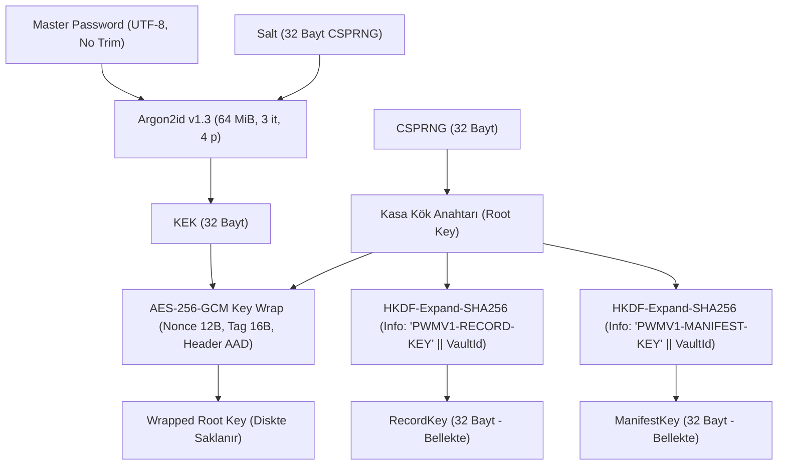

# Kasa Formatı ve Şifreleme Şartnamesi — VAULT_FORMAT (v1.0)

* **Sürüm:** 1.0 (Milestone M1.1)
* **Tarih:** 2026-10-10
* **Durum:** Onaylandı / Aktif
* **Hedef Platform:** Windows 11 (x64), .NET 10
* **İlgili Standartlar & Dokümanlar:** `THREAT_MODEL.md`, `ADR-002`, `ADR-003`, `SECURITY_TEST_MATRIX.md`

---

## 1. Genel Bakış ve Temel İlkeler

`PasswordManager` kasası, Windows 11 üzerinde yerel öncelikli (local-first) ve sıfır bilgi (zero-knowledge) ilkesiyle çalışan bir SQLite veritabanı dosyası (`vault.db`) içinde saklanır.

### Temel Mimari İlkeleri:
1. **Düz Metin (Plaintext) İzolasyonu:** Veritabanında hiçbir hesap bilgisi, kullanıcı adı, parola, URL, başlık veya arama indeksi düz metin olarak yer almaz. SQLite yalnızca şifrelenmiş ikili zarfları (encrypted envelopes) saklar.
2. **Kriptografik Sürüm Ayrımı:** Kripto format sürümü (`CryptoFormatVersion = 1`) ile veritabanı şema sürümü (`SchemaVersion = 1`) birbirinden bağımsız yönetilir. Veritabanı tablo yapısındaki değişiklikler kripto formatını bozmaz.
3. **Master Password Dokunulmazlığı:** Kullanıcının master password'ü diske veya loglara yazılmaz; gizlice `trim` veya `normalize` edilmez. UTF-8 bayt dizilimi doğrudan KDF girdisi olarak işlenir.
4. **Çift Kademeli Anahtar Hiyerarşisi:** Master password'den türetilen KEK (Key Encryption Key) yalnızca Kasa Kök Anahtarını (Root Key) sarmak (wrap) için kullanılır. Kayıtlar ve manifest doğrudan KEK ile değil, Root Key'den HKDF ile ayrıştırılan bağımsız alt anahtarlarla şifrelenir.
5. **Fail-Closed Güvenlik Garantisi:** Herhangi bir auth tag, AAD veya parametre sınır hatasında sistem fail-closed davranır; hiçbir kısmi veri çözülmez veya UI'ya aktarılmaz.

---

## 2. Kasa Başlığı (VaultHeader) ve İkili Format

Kasa başlığı, veritabanındaki `VaultHeader` tablosunda tek bir satır olarak saklanan ikili (binary) bir yapıdır.

### 2.1. İkili Alan Düzeni (Binary Layout)

| Sıra | Alan Adı | Boyut | Veri Türü / Kodlama | Açıklama |
| --- | --- | --- | --- | --- |
| 1 | `Magic` | 4 bayt | ASCII `"PWMV"` (`0x50, 0x57, 0x4D, 0x56`) | Dosya format tanımlayıcısı (PasswordManager Vault). |
| 2 | `CryptoFormatVersion` | 4 bayt | `uint32` (Big-Endian) | Kripto format sürümü. v1 için değeri `1`'dir. |
| 3 | `VaultId` | 16 bayt | Binary GUID (RFC 4122) | Kasanın benzersiz kimliği. Çapraz kasa enjeksiyonunu engeller. |
| 4 | `KdfAlgorithmId` | 2 bayt | `uint16` (Big-Endian) | `0x0001` = Argon2id v1.3. |
| 5 | `MemoryKiB` | 4 bayt | `uint32` (Big-Endian) | Argon2id bellek maliyeti (KiB cinsinden). Varsayılan: `65536` (64 MiB). |
| 6 | `Iterations` | 4 bayt | `uint32` (Big-Endian) | Argon2id yineleme sayısı. Varsayılan: `3`. |
| 7 | `Parallelism` | 4 bayt | `uint32` (Big-Endian) | Argon2id eşzamanlı kanal sayısı. Varsayılan: `4`. |
| 8 | `SaltLength` | 2 bayt | `uint16` (Big-Endian) | Salt uzunluğu (bayt). Varsayılan: `32`. |
| 9 | `Salt` | 32 bayt | Kriptografik Rastgele (CSPRNG) | KEK türetiminde kullanılan 256-bit rastgele salt. |
| 10 | `WrappedKeyNonce` | 12 bayt | Kriptografik Rastgele (CSPRNG) | Kök anahtarı sarmalayan AES-GCM 96-bit nonce. |
| 11 | `WrappedKeyTag` | 16 bayt | AES-GCM Auth Tag | Kök anahtar sarmalamasının 128-bit kimlik doğrulama etiketi. |
| 12 | `WrappedKeyCiphertext` | 32 bayt | AES-256-GCM Ciphertext | KEK ile şifrelenmiş 256-bit Kasa Kök Anahtarı (Root Key). |

*Toplam Başlık Boyutu:* 132 bayt.

---

## 3. Anahtar Yaşam Döngüsü ve Türetme Hiyerarşisi



### 3.1. Master Password ve KEK Türetimi (Argon2id)
* **Girdi:** Kullanıcı tarafından girilen karakterler UTF-8 bayt dizilimine (`byte[]`) dönüştürülür. Boşluklar veya karakterler gizlice kırpılmaz (`trim`), Unicode normalizasyonu yapılmaz.
* **Algoritma:** Argon2id (v1.3, RFC 9106 uyumlu).
* **Varsayılan Parametreler:**
  - Bellek: `64 MiB` ($65,536 \text{ KiB}$)
  - İterasyon ($t$): `3`
  - Paralellik ($p$): `4` kanal
  - Salt: `32 bayt` (CSPRNG)
  - Çıktı: `32 bayt` (256-bit KEK)
* **DoS ve Sınır Kontrolü Politikası:**  
  Kasa açılırken veya import edilirken okunan parametreler Argon2id çalıştırılmadan önce doğrulanır:
  - Bellek: $\min 16 \text{ MiB} \le \text{MemoryKiB} \le 512 \text{ MiB}$
  - İterasyon: $1 \le \text{Iterations} \le 10$
  - Paralellik: $1 \le \text{Parallelism} \le 16$
  - Salt Uzunluğu: $16 \le \text{SaltLength} \le 64$ bayt  
  Bu aralıkların dışındaki değerler anında fail-closed ile reddedilir.

### 3.2. Kasa Kök Anahtarı (Root Key) ve Sarmalama (Key Wrap)
* Kasa oluşturulduğunda 32 bayt kriptografik rastgele (CSPRNG) Kök Anahtar (`RootKey`) üretilir.
* Kök Anahtar, KEK kullanılarak **AES-256-GCM** ile şifrelenir.
* **Key Wrap AAD (Additional Authenticated Data):**  
  Başlıktaki ilk 68 bayt kanonik olarak bağlanır:
  $$\text{AAD}_{\text{wrap}} = \text{Magic (4B)} \mathbin{\Vert} \text{CryptoFormatVersion (4B)} \mathbin{\Vert} \text{VaultId (16B)} \mathbin{\Vert} \text{KdfId (2B)} \mathbin{\Vert} \text{MemoryKiB (4B)} \mathbin{\Vert} \text{Iterations (4B)} \mathbin{\Vert} \text{Parallelism (4B)} \mathbin{\Vert} \text{SaltLength (2B)} \mathbin{\Vert} \text{Salt (32B)}$$
  Bu sayede saldırganın dosyadaki KDF parametrelerini veya Salt'ı değiştirmesi durumunda auth tag doğrulaması başarısız olur ve anahtar çözülmez.

### 3.3. Kriptografik Anahtar Ayrımı (Key Separation — HKDF-SHA-256)
Root Key doğrudan hiçbir veriyi şifrelemez. `HKDF-Expand` (RFC 5869) kullanılarak amaca özel alt anahtarlar türetilir:
* **RecordKey (Kayıt Anahtarı):**
  $$\text{RecordKey} = \text{HKDF-Expand}(\text{RootKey}, \text{info} = \text{UTF8}("\text{PWMV1-RECORD-KEY}") \mathbin{\Vert} \text{VaultId (16B)}, L = 32)$$
* **ManifestKey (Manifest Anahtarı):**
  $$\text{ManifestKey} = \text{HKDF-Expand}(\text{RootKey}, \text{info} = \text{UTF8}("\text{PWMV1-MANIFEST-KEY}") \mathbin{\Vert} \text{VaultId (16B)}, L = 32)$$

---

## 4. Şifreli Zarflar (Encrypted Envelopes)

Her şifreli öğe (kayıt ve manifest) bağımsız bir AES-256-GCM zarfı olarak saklanır.

### 4.1. Kayıt Zarfı (VaultRecord Envelope)

Her kayıt için bağımsız 96-bit CSPRNG nonce üretilir.

* **Kayıt AAD Kanonik Yapısı:**
  $$\text{AAD}_{\text{record}} = \text{VaultId (16B)} \mathbin{\Vert} \text{RecordId (16B)} \mathbin{\Vert} \text{EnvelopeVersion (4B, Big-Endian)} \mathbin{\Vert} \text{UTF8}("\text{PWMV1-RECORD}")$$
  *Güvenlik Etkisi:* Bir kaydın başka bir kasaya kopyalanması (`VaultId` uyuşmazlığı) veya aynı kasa içinde başka bir kayıt ID'sinin yerine konması (`RecordId` uyuşmazlığı) durumunda AEAD auth tag anında patlar.

* **Düz Metin (Plaintext) Kayıt Payload'ı (Kanonik JSON):**
  ```json
  {
    "schema_version": 1,
    "title": "GitHub",
    "username": "developer@example.com",
    "password": "SyntheticSecretPassword123!",
    "urls": ["https://github.com/login"],
    "notes": "Work account",
    "category": "Development",
    "is_favorite": true,
    "created_at": "2026-10-10T14:30:00.0000000Z",
    "updated_at": "2026-10-10T14:30:00.0000000Z",
    "revision": 1
  }
  ```

* **Alan Boyut Sınırları:**
  - `title`: Maksimum 256 karakter.
  - `username`: Maksimum 256 karakter.
  - `password`: Maksimum 4096 karakter (uzun token/parolaları destekler).
  - `urls`: Dizi eleman sayısı maks 10, her biri maks 2048 karakter (yalnızca `http://` ve `https://` şemaları geçerlidir).
  - `notes`: Maksimum 10,000 karakter.
  - `category`: Maksimum 64 karakter.

### 4.2. Manifest Zarfı (VaultManifest Envelope)

Kasadaki aktif kayıtların listesini, revizyon numaralarını ve kasa yapılandırmasını saklar.

* **Manifest AAD Kanonik Yapısı:**
  $$\text{AAD}_{\text{manifest}} = \text{VaultId (16B)} \mathbin{\Vert} \text{EnvelopeVersion (4B, Big-Endian)} \mathbin{\Vert} \text{UTF8}("\text{PWMV1-MANIFEST}")$$

* **Düz Metin Manifest Payload'ı (Kanonik JSON):**
  ```json
  {
    "schema_version": 1,
    "vault_name": "Personal Vault",
    "categories": ["General", "Work", "Finance", "Social"],
    "records": [
      {
        "record_id": "a0000000-0000-0000-0000-000000000001",
        "revision": 1
      }
    ],
    "last_modified_at": "2026-10-10T14:30:00.0000000Z"
  }
  ```
  *Bütünlük Rolü:* SQLite tablosundan gizlice bir kaydın silinmesi veya eski bir kaydın araya sokulması durumunda, manifestteki kayıt listesi ile fiziksel kayıtlar arasındaki uyuşmazlık tespit edilir.

---

## 5. SQLite Veritabanı Tablo Şeması

SQLite şeması `SchemaVersion = 1` olarak versiyonlanır.

```sql
-- Kasa Başlığı (Tek Satır: id = 1)
CREATE TABLE IF NOT EXISTS VaultHeader (
    Id INTEGER PRIMARY KEY CHECK (Id = 1),
    HeaderBytes BLOB NOT NULL,
    CreatedAt TEXT NOT NULL,
    UpdatedAt TEXT NOT NULL
);

-- Kasa Manifesti (Tek Satır: id = 1)
CREATE TABLE IF NOT EXISTS VaultManifest (
    Id INTEGER PRIMARY KEY CHECK (Id = 1),
    EnvelopeVersion INTEGER NOT NULL,
    Nonce BLOB NOT NULL,
    Tag BLOB NOT NULL,
    Ciphertext BLOB NOT NULL,
    UpdatedAt TEXT NOT NULL
);

-- Şifrelenmiş Kayıtlar
CREATE TABLE IF NOT EXISTS VaultRecords (
    RecordId TEXT PRIMARY KEY,
    EnvelopeVersion INTEGER NOT NULL,
    Nonce BLOB NOT NULL,
    Tag BLOB NOT NULL,
    Ciphertext BLOB NOT NULL,
    CreatedAt TEXT NOT NULL,
    UpdatedAt TEXT NOT NULL
);

-- Kasa Metadata ve Şema Versiyonu
CREATE TABLE IF NOT EXISTS VaultMetadata (
    Key TEXT PRIMARY KEY,
    Value TEXT NOT NULL
);
```

---

## 6. Güvenlik ve Yaşam Döngüsü Protokolleri

### 6.1. Master Password Değişimi Protokolü (Key Re-Wrap)
Master password değiştirildiğinde kayıtların tamamını yeniden şifrelemeye gerek kalmaz:
1. Kullanıcıdan mevcut ve yeni master password alınır; mevcut parola doğrulanır ve `RootKey` belleğe alınır.
2. Yeni master password için yeni bir 32 bayt CSPRNG Salt üretilir.
3. Yeni KEK türetilir (`Argon2id`).
4. Mevcut `RootKey`, yeni KEK ve yeni CSPRNG Nonce ile yeniden şifrelenir (Re-wrap).
5. Yeni `VaultHeader` ikilisi tek bir SQLite transaction içinde güncellenir.
6. Geçici KEK ve parola bellekten `ZeroMemory` ile temizlenir.

### 6.2. Kök Anahtar Rotasyonu (Root Key Rotation)
Kök anahtarın sızdığından şüphelenildiğinde veya $2^{32}$ şifreleme sınırına yaklaşıldığında uygulanır:
1. Yeni bir 32 bayt CSPRNG `RootKey` üretilir.
2. Yeni `RecordKey` ve `ManifestKey` türetilir.
3. Mevcut tüm kayıtlar ve manifest çözülüp yeni anahtarlar ve yeni nonce'larla yeniden şifrelenir.
4. Yeni `RootKey`, aktif KEK ile sarılır.
5. Tüm güncelleme atomik bir transaction içinde tamamlanır.

### 6.3. Fail-Closed ve Hata Yönetimi İlkesi
* Başlık ikilisinin boyutu 132 bayttan farklıysa,
* `Magic` baytları `"PWMV"` değilse,
* `CryptoFormatVersion` desteklenmeyen bir değerse,
* KDF parametreleri izin verilen aralıkların dışındaysa,
* AES-GCM kimlik doğrulama etiketi (`Tag`) doğrulanamazsa,
* Kayıt veya Manifest AAD uyuşmazlığı varsa:

**Uygulama anında işlemi durdurur (`fail-closed`) ve çağırıcıya saldırganın ayrım yapamayacağı ortak bir hata döner:**  
`"Kasa açılamadı: kimlik doğrulama başarısız veya veri bozuk."`
